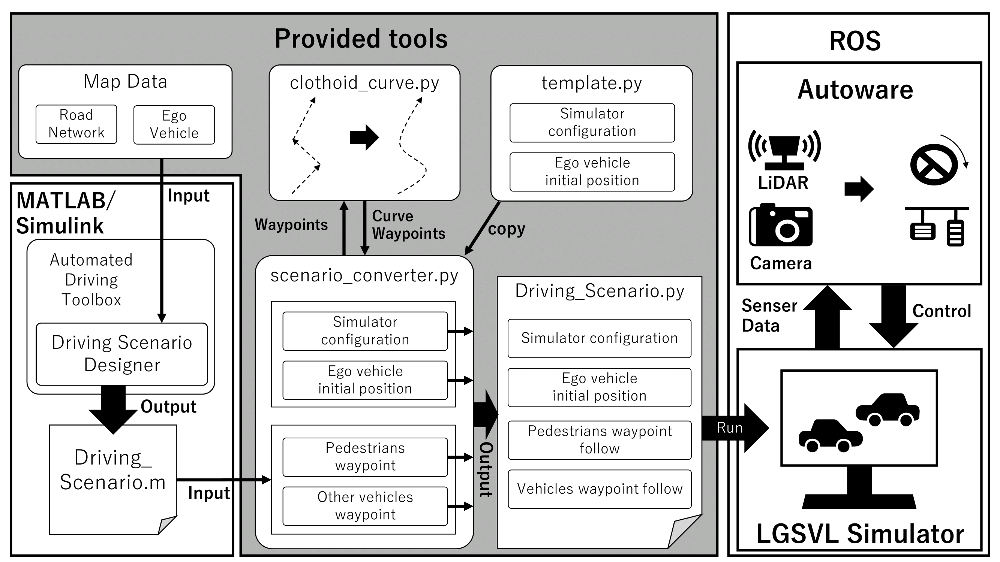

# test_framework

This framework can generate a driving scenario file for LGSVL simulator from a MATLAB file.
Driving Scenario Designer provided by MATLAB/Simulink enables developers to create driving scenarios graphically.
The scenarios are converted to the suite formats for LGSVL simulator by this framework.

## System Model

## Requirements
- LGSVL simulator
- Python API for LGSVL simulator
- MATLAB/Simulink
	- Automated Driving Toolbox

## Release Compatibility
- LGSVL simulator 2020.06
- Python 3.5
- MATLAB R2020b

## Research Papers for Citation